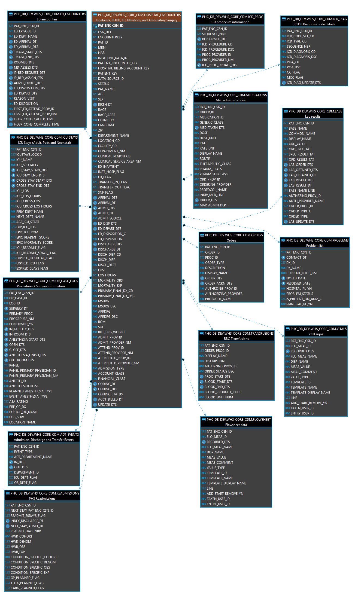

 __Core CDM__ is a set of curated tables in a Cloud Data Warehouse (CDW) to address most clinical data science applications and use-cases.

__Core CDM__ is designed to reduce the friction of acquiring and 
analyzing raw data from the CDW while leveraging the strengths of the Snowflake data platform. 

__Core CDM__ is patterned after other popular clinical data models (ie 
[MIMIC-III](https://mimic.physionet.org/gettingstarted/overview/) and
[OMOP](https://www.ohdsi.org/data-standardization/the-common-data-model/)
) that have a handful of de-normalized tables 
that are more intuitive and require less effort to combine and prepare for analysis than typical database models 
such as 'star schemas'. 

* __Snowflake optimization__: 
Snowflake has two primary cost drivers - data storage and data computation. 
Data storage is relatively inexpensive and computation is more expensive, 
particularly with complex queries with numerous table joins.
 A best practice in Snowflake is to 
[denormalize complex queries or views to static tables](https://medium.com/hashmapinc/5-things-i-wish-i-knew-before-learning-snowflake-6d68ad05560b).

__Core CDM__ addresses a few issues with the existing CDW architecture: 
 
* __Different primary keys__: 
The existing main databases all use different primary keys, 
which makes it more difficult to join Unity data with Lucidity data for example.
 __Core CDM__ uses
  'PAT_ENC_SID' as the primary key for nearly all tables.  

* __Data delays__: 
While SagaLucidity is updated daily for the previous 24hrs, 
other CDW databases have a delayed refresh cadence 
that generally requires the account coding to be complete, 
which can be 3-7 days after discharge.  

 __Core CDM__ is updated every morning at 7am 
with the data from the previous 24 hours, 
including current admissions and discharges BEFORE coding is complete. 
This means that the same data model can be used for retrospective projects based on coding 
as well as more timely projects based on Saga documentation and clinical data. 

* __Non-standard naming conventions__: 
Tables in SagaLucidity, Unity, Marimba, Canoodle, CPS datamarts 
and other databases 
use different naming conventions for the same data fields and data types. 
In addition, the column names frequently are named differently than the data types (ie. 
columns with `_TIME` actually have dates, 
columns with `_DATE` have datetime values, 
foreign keys are character columns in one table and numeric in another
etc.)  

 __Core CCDM__
uses a controlled vocabulary where:  

   - date fields end in `_DT` in ISO format
   - datetime fields end in `_DTS` in ISO format
   - Boolean fields end in `_FLAG` and are coded to 0/1  
   - Numeric keys end in `_ID`
   - Text keys end in `_CD`

<!--
## Entity Relationship Diagram (ERD)

-->